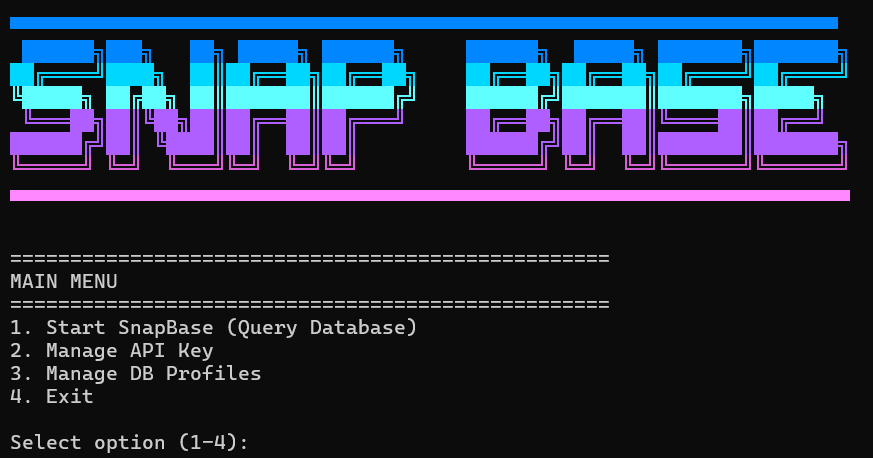
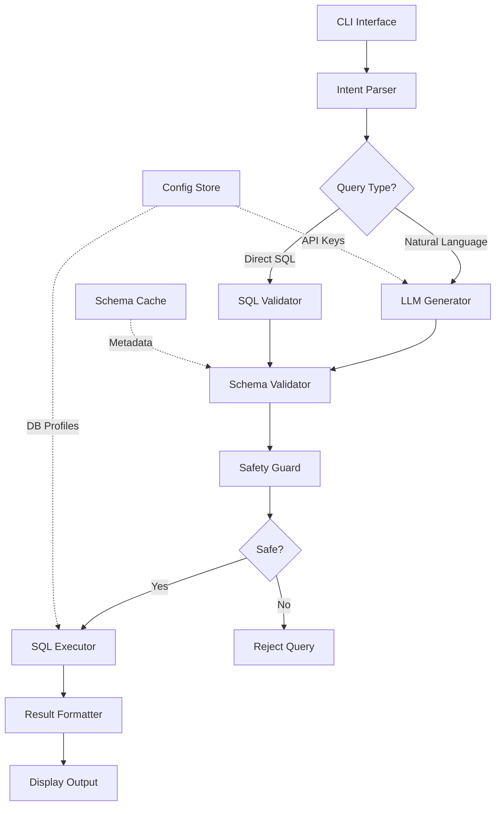
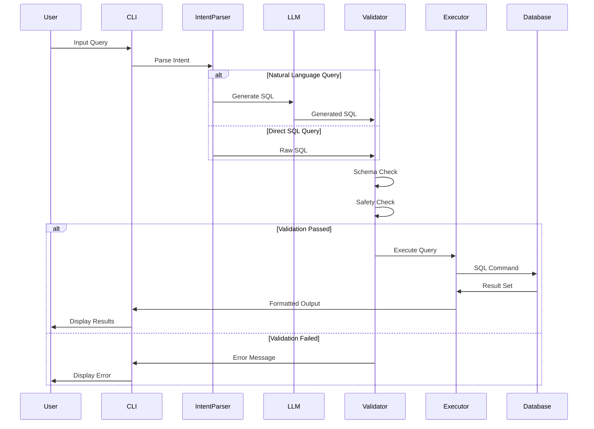
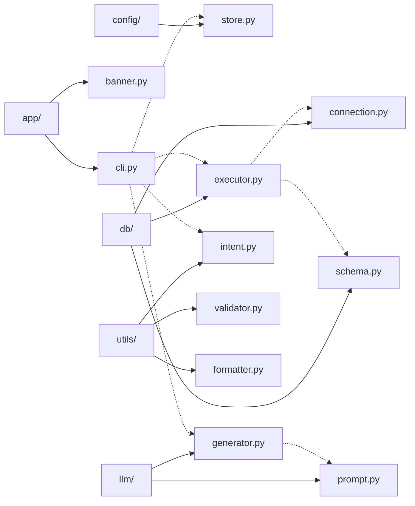
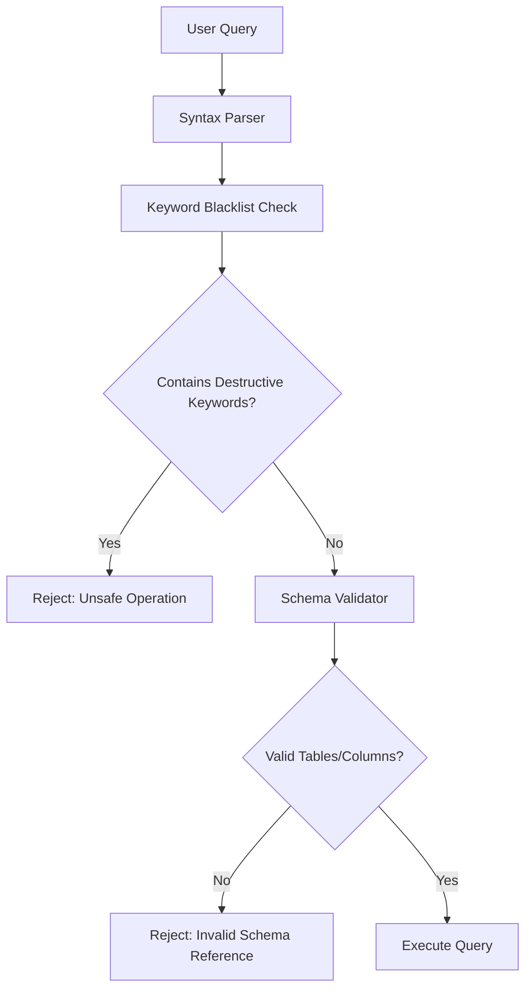

# SnapBase


<p align="center">
  
</p>

SnapBase is a production-grade CLI tool that provides natural language to SQL query translation with built-in safety mechanisms, schema validation, and persistent configuration management. The system leverages NVIDIA's LLaMA-4 model for intelligent query generation while maintaining strict execution guardrails.

## Table of Contents

- [Architecture](#architecture)
- [Features](#features)
- [System Design](#system-design)
- [Installation](#installation)
- [Usage](#usage)
- [Security Model](#security-model)
- [Query Support Matrix](#query-support-matrix)
- [Known Limitations](#known-limitations)
- [Technical Stack](#technical-stack)
- [License](#license)

## Architecture



## Features

### Core Capabilities

- **Natural Language Processing**: Translates plain English queries into SQL using NVIDIA LLaMA-4 (Maverick)
- **Direct SQL Execution**: Supports raw SQL input for advanced users
- **Schema Awareness**: Validates table and column references against actual database schema
- **Safety Guardrails**: Blocks destructive operations (DROP, DELETE, TRUNCATE, ALTER)
- **Persistent Configuration**: Stores API credentials and database profiles
- **Database Switching**: Change active database without restarting the session
- **Stable Connection Management**: Handles MySQL connections with automatic reconnection
- **Formatted Output**: Tabular display with proper alignment and readability

### Design Principles

SnapBase differentiates itself through:
- **Safety-first architecture**: Prevention of destructive operations at multiple validation layers
- **Transparent error handling**: Clear feedback on failures and limitations
- **Production-grade structure**: Modular design with separation of concerns
- **Schema validation**: Prevents hallucinated table/column references

## System Design

### Query Processing Flow



### Component Architecture



### Project Structure

```
snapbase/
├── app/                    # CLI interface and user interaction
│   ├── cli.py             # Main command loop
│   └── banner.py          # Terminal UI elements
├── config/                 # Configuration management
│   └── store.py           # Persistent storage handler
├── db/                     # Database layer
│   ├── connection.py      # MySQL connection manager
│   ├── executor.py        # Query execution engine
│   └── schema.py          # Schema introspection
├── llm/                    # LLM integration
│   ├── generator.py       # SQL generation logic
│   └── prompt.py          # Prompt engineering
├── utils/                  # Utility modules
│   ├── intent.py          # Query intent classification
│   ├── sql_validator.py   # SQL safety validation
│   ├── sql_cleaner.py     # SQL sanitization
│   ├── formatter.py       # Output formatting
│   └── separators.py      # UI separators
├── main.py                 # Application entry point
├── pyproject.toml          # Package configuration
├── requirements.txt        # Python dependencies
└── snapbase_config.json    # Runtime configuration
```

## Installation

### Prerequisites

- Python 3.9 or higher
- MySQL server instance (running and accessible)
- NVIDIA API key with LLaMA-4 access (NIM platform)

### Setup Instructions

#### 1. Clone Repository

```bash
git clone https://github.com/Prateekkp/SnapBase.git
cd snapbase
```

#### 2. Install Dependencies

```bash
pip install -e .
```

This registers the `snapbase` command globally in your environment.

#### 3. Verify Installation

```bash
snapbase --version
```

## Usage

### Starting the CLI

```bash
snapbase
```

### Command Reference

| Command               | Description                           |
| --------------------- | ------------------------------------- |
| `show tables`         | List all tables in current database   |
| `describe <table>`    | Show table schema                     |
| `<natural language>`  | Translate to SQL and execute          |
| `<raw SQL>`           | Execute SQL directly                  |
| `:switch_db`          | Change active database                |
| `exit` / `quit`       | Terminate session                     |

### Example Session

```sql
SnapBase> show tables
+------------------+
| Tables           |
+------------------+
| customers        |
| orders           |
| products         |
+------------------+

SnapBase> list all customers from Delhi
Executing: SELECT * FROM customers WHERE city = 'Delhi'
+----+----------+-------+
| id | name     | city  |
+----+----------+-------+
| 1  | John Doe | Delhi |
+----+----------+-------+

SnapBase> describe orders
+-------------+-------------+------+
| Field       | Type        | Null |
+-------------+-------------+------+
| order_id    | int(11)     | NO   |
| customer_id | int(11)     | YES  |
| order_date  | datetime    | YES  |
+-------------+-------------+------+

SnapBase> :switch_db
Available databases: [...]

SnapBase> exit
```

## Security Model

### Query Validation Layers



### Blocked Operations

The following SQL operations are blocked at the validation layer:

| Operation Category | Blocked Keywords                      | Rationale                 |
| ------------------ | ------------------------------------- | ------------------------- |
| Data Definition    | DROP, CREATE, ALTER                   | Schema modification       |
| Data Manipulation  | DELETE, TRUNCATE, INSERT, UPDATE      | Data modification         |
| User Management    | GRANT, REVOKE                         | Permission changes        |
| System Operations  | SHUTDOWN, LOAD DATA, OUTFILE          | System-level operations   |

### Allowed Operations

- SELECT statements (with all clauses: WHERE, JOIN, GROUP BY, ORDER BY)
- SHOW commands (TABLES, DATABASES, COLUMNS)
- DESCRIBE statements
- EXPLAIN queries

## Query Support Matrix

| Query Category           | Support Level | Notes                                      |
| ------------------------ | ------------- | ------------------------------------------ |
| SHOW / DESCRIBE          | Full          | Direct passthrough                         |
| SELECT (simple)          | Full          | Single table queries                       |
| Aggregations             | Full          | COUNT, SUM, AVG, MIN, MAX, GROUP BY        |
| Joins                    | Full          | INNER, LEFT, RIGHT joins                   |
| Subqueries               | Partial       | Simple subqueries supported                |
| Correlated Subqueries    | Limited       | May generate incorrect SQL                 |
| Window Functions         | Partial       | Depends on MySQL version                   |
| Common Table Expressions | Limited       | Complex CTEs may fail                      |
| DDL / DML Operations     | Blocked       | Intentionally disabled                     |

## Known Limitations

### Technical Constraints

1. **Complex Query Accuracy**: Multi-level correlated subqueries and advanced SQL patterns may produce logically incorrect results. The LLM occasionally misinterprets complex natural language specifications.

2. **Schema Dependency**: Query generation requires accurate schema metadata. Dynamic or temporary tables may not be recognized.

3. **Performance**: Large result sets are fetched entirely into memory before display. Queries returning millions of rows may cause memory issues.

4. **Concurrent Connections**: Each SnapBase instance maintains a single connection. Concurrent query execution is not supported.

### Design Trade-offs

SnapBase prioritizes **reliability and safety over feature completeness**. The system is optimized for:
- Data analysis workflows
- Schema exploration
- Educational use cases
- Analyst-level SQL generation

It is not designed for:
- Database administration tasks
- Production data modification
- Complex OLAP workloads
- High-throughput query execution

## Technical Stack

### Core Dependencies

| Component                | Version | Purpose                           |
| ------------------------ | ------- | --------------------------------- |
| Python                   | 3.9+    | Runtime environment               |
| mysql-connector-python   | Latest  | MySQL database driver             |
| requests                 | Latest  | HTTP client for LLM API           |
| tabulate                 | Latest  | Table formatting                  |
| NVIDIA LLaMA-4 (Maverick)| -       | Natural language to SQL           |

### External Services

- **NVIDIA NIM Platform**: Provides API access to LLaMA-4 model
- **MySQL Server**: Database backend (tested on MySQL 5.7+)

## Use Cases

### Target Scenarios

- **Data Analysis**: Rapid database exploration without writing SQL
- **Learning Tool**: Educational platform for SQL learning with AI assistance
- **Schema Discovery**: Quick inspection of unfamiliar database structures
- **Safe Querying**: Alternative to raw SQL console with built-in guardrails
- **Portfolio Projects**: Demonstration of CLI tool development and AI integration

## Contributing

Contributions are welcome. Please ensure:
- All tests pass before submitting pull requests
- Code follows existing style conventions
- New features include appropriate documentation
- Security implications are considered for query handling changes

## License

MIT License - see LICENSE file for full text.

Free to use, modify, and distribute. Attribution appreciated.

---

**SnapBase** - Production-grade AI-powered SQL CLI with safety guarantees.

